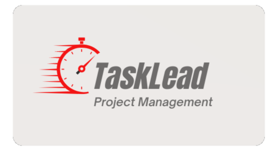

  

<h3 align="center">TaskLead Project Management</h3>

---

 Company friendly and user-collaborative application for project management!
      

## 

- [About](#about)
- [Installing](#installing)
- [Usage](#usage)
- [Built With](#built_using)
- [Authors](#authors)
- [Questions](#questions)

## 

This repository is where our [team](https://github.com/raealejandrino/Tasklead-repo/graphs/contributors) develops a full-stack project management application using Model View Controller semantics with Handlebars.js, Sequelize Object Relational Mapper, Bcrypt, Sass, and more. Whether you're looking to track bugs, delegate task assignments to users, or even utilize agile methodology, this application can help organize full scale projects whilst encouraging user collaboration.         

## 

Once you have cloned the repo down from GitHub, you will want to run `npm install` in the command line to install all of the Node Modules needed to run the application.

## 

In order to run this program locally you will need to:

1. Clone this repository to receive all the files.
2. Run `npm install` in the terminal to download all the needed dependencies (makes sure you are in the correct file directory).
3. Create a `.env` file and input the followings keys: `DB_NAME='task_lead_db' DB_USER='your user' DB_PW='your password'` Where the values for `DB_USER` AND `DB_PW` are your MySQL credentials
4. Run `source db/schema.sql` in your MySQL command line interface to initialize the database
<!-- 5. (OPTIONAL) Run `npm run seed` to initialize seeding scripts to insert test data into the database -->
5. Run `npm start` in the terminal to start a live server locally.
6. Use any preferred browser application to run the localhost URL.

## 

- JavaScript
- Sequelize
- MySQL
- Express.js
- Node.js
- Bcrypt
- Bootstrap
- Sass
- Handlebars.js

## 

- [@raealejandrino](https://github.com/raealejandrino)
- [@lkalicki](https://github.com/lkalicki)
- [@AbeerTannous](https://github.com/AbeerTannous)
- See also the list of [contributors](https://github.com/coding-boot-camp/fantastic-umbrella/graphs/contributors) who participated in this project.

## 

- Feel free to open an issue or contact our team if you have any questions about the repo.

## License

Copyright (c) Microsoft Corporation. All rights reserved.

Licensed under the [MIT](LICENSE.txt) license.
